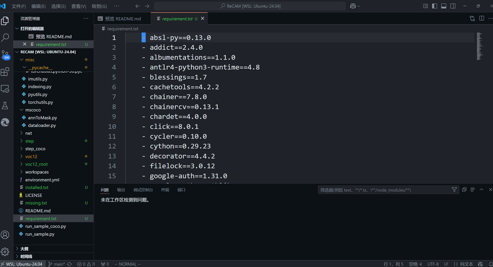
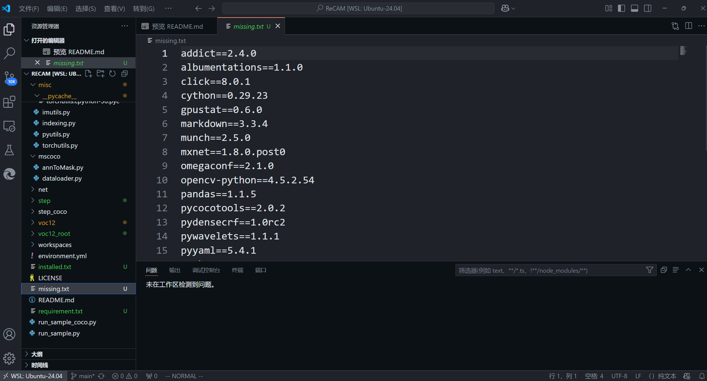
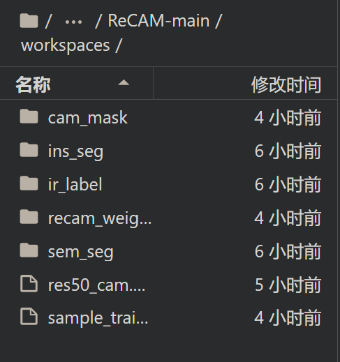

# Repetition:from zero to one

## 复现项目

[ReCAM Github link](https://github.com/zhaozhengChen/ReCAM)

[arXiv link](https://arxiv.org/abs/2203.00962)


## 服务器的WSL2的安装与基本配置

由于自己的笔记本真的跑不动这个项目,所以只能在服务器上装WSL.

**Step1:** 下载WSL2;


## 环境配置

~~1. 安装`requirement.txt`里面各个包,基本就是`conda install + package name`就行.不过记得配置清华源:);
2. 建议在linux环境下配置,不然问题比较多;~~

windows配置破防了,换了WSL,装的Ubuntu22.04LTS
没想到一次复现状况百出:(
(其实看包名称就知道这个环境基本是要在Linux上跑)

一般来说是`git clone`复现链接然后对着`environment.yml`直接conda安装就好了.

```shell
cd /ReCAM #destination folder
git clone + [url] 
conda create -f environment.yml -n #it's your environment name 
#option -python=3.x
```

我这次安装出现`pip install error`,解决方案是把这个yml文件中的`-pip:`后面剩下的部分拆分成一个单独的`requirement.txt`,激活环境上面创建的conda环境然后再`pip`或者`pip3`安装剩下的依赖项.

```shell
conda activate recam #your environment name
pip install -r requirement.txt
```

## 小插曲

我在generate seed那步运行的时候显示python package未导入,`pip list`一检查发现很多都没有装,然后就用了一个脚本去生成一个`missing.txt`.

```shell
pip freeze | awk -F '==' '{print $1}' > installed.txt
grep -v -f installed.txt requirement.txt > missing.txt
pip install -r missing.txt
```

最后检查出来的问题是missing.txt和之前的requirement.txt文件格式不对.:joy:

这个是错误格式,pip读不出来：


这个是正确格式,pip能正确安装：


**但是**

安装`pydensecrf`的时候还是不行，会显示build wheel failed.

然后尝试了一下更新pip:

```shell
pip3 install --upgrade pip
pip install --upgrade pip setuptools wheel
```

还是不对,然后发现是这说明Conda环境的 ld 链接器与系统的动态库不兼容或不匹配，导致链接失败.

报错如下：

```shell
/home/user/miniconda3/envs/recam/compiler_compat/ld: cannot find /lib/x86_64-linux-gnu/libm.so.6
```

解决方案是用conda安装这个package:

```shell
conda install -c conda-forge pydensecrf
```

装是装上了,但是还是跑不起来
然后一个一个手动`pip install`检验是哪里出了问题,发现是`pydensecrf`

所以最后还是conda安装`pydensecrf`,完成了环境配置.:smile:

```shell
conda install -c conda-forge pydensecrf==1.0rc2
```

## training

以这次项目的`VOC`数据集为例:

**Step1:** download dataset到指定目录,本项目要求是新建一个`voc12_root`的folder;

```shell
aria2c http://host.robots.ox.ac.uk/pascal/VOC/voc2012/VOCtrainval_11-May-2012.tar
```

**Step2:** 解压tar文件;

```shell
tar -xvf #filename
rm #filename
```

**Step3:** 激活seed;

首先指定一个workspace存放models和logs,specify为folder `workspaces`.

然后run python脚本:

```shell
CUDA_VISIBLE_DEVICES=0 python run_sample.py --voc12_root ./voc12_root/VOCdevkit/VOC2012/ --work_space workspaces --train_cam_pass True --train_recam_pass True --make_recam_pass True --eval_cam_pass True 
```

注意这里的`--voc12_root`为`VOC`解压后的数据集本体路径,前文中我们在这个ReCAM文件夹下面新建了`voc12_root`文件夹,所以此处参数应该指定为`./voc12_root/VOCdevkit/VOC2012/`.

~~然后就是漫长的等待,不过记得给C盘或者训练所在的盘留足够的内存,不然会触发内存锁警告.~~

等了很久也跑不出来,所以换了实验室的服务器去跑.

以上均为在本地WSL2环境下配置环境的步骤,由于实验室服务器不让装Linux,所以租了一台服务器.直接一键完成配置:

```shell
conda env create -f environment.yml
```

运行脚本同上.(batch_sizes从default的16调节到8，云服务器为2080Ti)

**Generated seeds belike:**



**Step4:** Train IRN and generate pseudo masks;

训练IRN和生成伪装掩膜的python脚本:

```shell
CUDA_VISIBLE_DEVICES=0 python run_sample.py --voc12_root ./voc12_root/VOCdevkit/VOC2012/ --work_space workspaces --cam_to_ir_label_pass True --train_irn_pass True --make_sem_seg_pass True --eval_sem_seg_pass True --irn_batch_size 8
```

By the way,保存一下中间结果:

```shell
tar -czf workspaces.tar workspaces/
```

